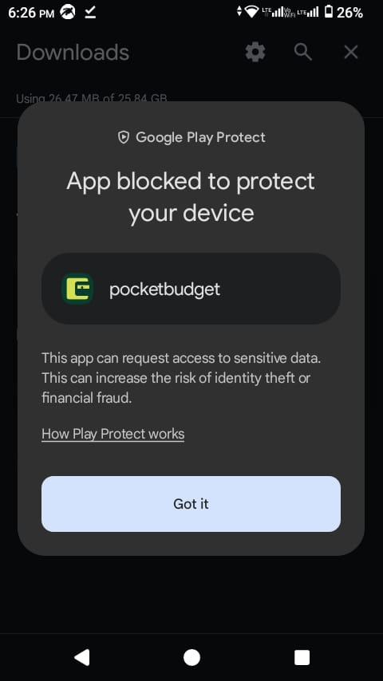
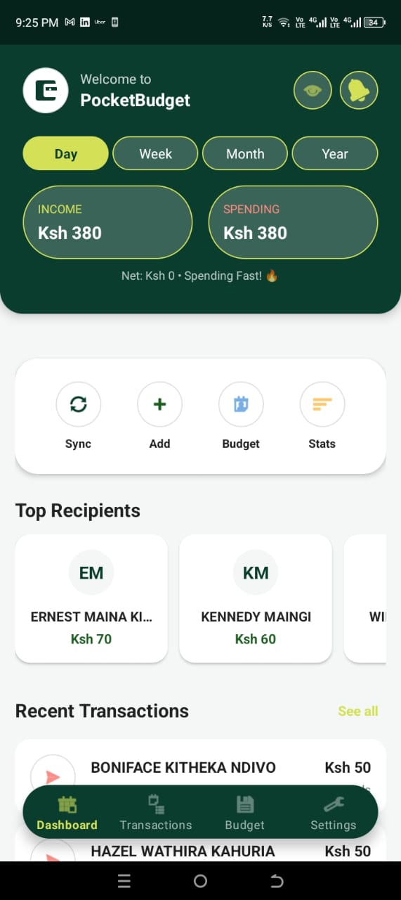
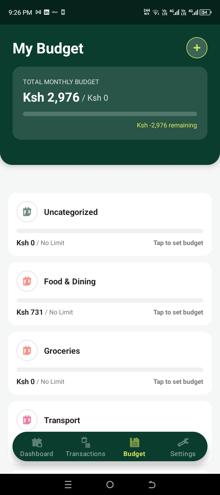
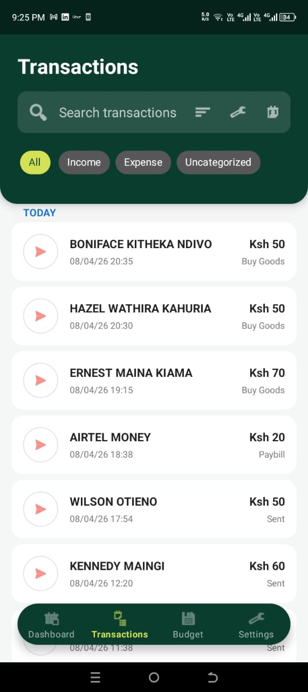
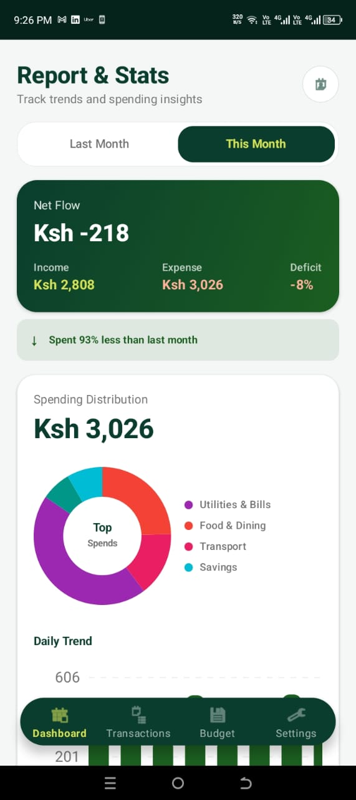
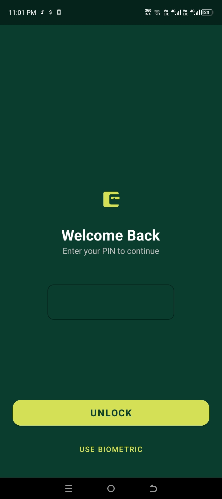
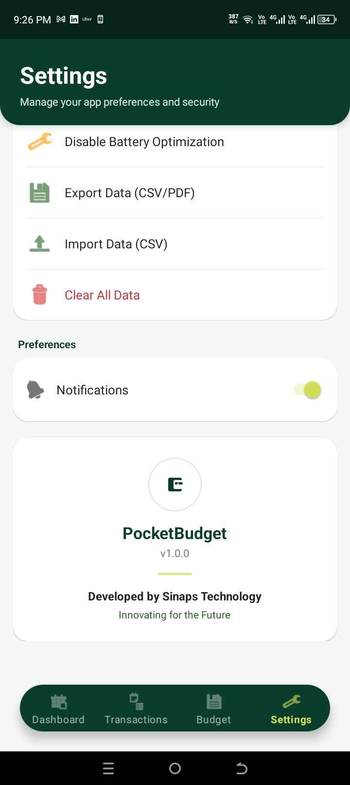

# PocketBudget KE

PocketBudget KE helps you track spending from M-Pesa messages and understand where your money goes.

## Download the App

[](https://github.com/Bouric0076/pocketbudget/releases)

- Testing builds are available from GitHub Releases:
  https://github.com/Bouric0076/pocketbudget/releases

Always download the latest tagged release unless a specific version is shared with you.

**Track Downloads:** Each release displays download counts on the GitHub Releases page. Check back anytime to see how many users have downloaded your app!

## How to Install (Android)

### ⚠️ Important: Google Play Protect Warning on First Install

**What You'll See:**

When you first install PocketBudget KE from GitHub, Google Play Protect may show a warning:



The warning message reads:
```
🛡️ Google Play Protect

App blocked to protect your device

This app can request access to sensitive data.
This can increase the risk of identity theft or financial fraud.
```

**This is a false positive — the app is completely safe.** Here's why:

- PocketBudget reads M-Pesa SMS messages to automatically categorize your spending
- Android's Play Protect flags ANY app requesting SMS permission as potentially risky (conservative security)
- **PocketBudget is NOT malicious:**
  - ✅ Runs 100% offline (no internet calls, no data sent)
  - ✅ All data encrypted locally on your phone
  - ✅ Fully open-source on GitHub (code is public)
  - ✅ Stores everything in encrypted Room database

### Step-by-Step Installation

1. **Download the APK** from [GitHub Releases](https://github.com/Bouric0076/pocketbudget/releases)
   - Always download the latest tagged release (e.g., `v1.0` or higher)
   - Look for the `.apk` file attached to each release

2. **Open the APK** on your phone
   - Use your file manager or browser downloads folder
   - Tap to open it

3. **Allow Installation from Unknown Sources** (if prompted)
   - Your browser or file manager will ask: "Allow this app to install apps?"
   - This is normal for GitHub downloads (outside Play Store)
   - Tap **"Install"** or **"Allow"**

4. **Google Play Protect Warning Appears** ← This is the expected step
   - You'll see "App blocked to protect your device" with a **"Got it"** button
   - **Tap "Got it"**
   - Installation will NOT proceed on first attempt (intentional Safety behavior)
   - **Don't worry — this is normal**

5. **Wait 10-30 Seconds**
   - Let Play Protect finish its check
   - You may be returned to the file manager or downloads

6. **Install Again** ← Second attempt succeeds
   - Tap the APK file again to install
   - **This time, installation will complete successfully**
   - Play Protect allows apps after the first pass

7. **Open PocketBudget KE**
   - Tap "Open" when installation finishes
   - Or find it in your app drawer

### Why Play Protect Blocks on First Install

Google's Play Protect is designed to:
- Scan apps for malicious behavior
- Flag any app requesting "sensitive" permissions (like SMS)
- Block installation on first attempt as a precaution
- Allow after verification if no threats detected

Since PocketBudget legitimately needs SMS access for M-Pesa transactions, Play Protect flags it. But after the first block, it realizes the app is safe and allows installation to proceed.

### Installation Troubleshooting

**Still blocked after 2nd attempt?**

Try disabling Play Protect temporarily:
1. Go to **Settings → Apps & Notifications → Google Play Protect** (or search "Play Protect")
2. Tap the settings icon (⚙️) in top right
3. **Uncheck** "Scan apps with Play Protect"
4. Try installing PocketBudget again
5. **Re-enable** Play Protect after installation completes

## What the App Does
- Reads M-Pesa transaction SMS messages (with your permission).
- Extracts and saves transaction details.
- Organizes spending into categories.
- Shows summaries and trends to help you budget better.

## App Screenshots

### Dashboard & Overview
View your income, spending, and budget status at a glance:

| Dashboard | Budget Management |
|-----------|------------------|
|  |  |

### Transactions & Analytics
Track individual transactions and analyze spending patterns:

| Transactions List | Analytics & Stats |
|------------------|------------------|
|  |  |

### Security & Settings
Secure your app with PIN lock and customize preferences:

| PIN Lock | Settings |
|----------|----------|
|  |  |

## First-Time Setup
1. Open the app.
2. Allow required permissions (SMS and notifications, if requested).
3. Review your dashboard and recent transactions.
4. Add or adjust categories based on your spending style.

## Privacy and Data
- The app is designed to be offline-first.
- Your transaction data is stored locally on your phone.
- You can stop SMS access anytime from Android App Permissions.

## Testing Feedback
This project is currently in a testing phase.

Please share:
- App version used (from the release page)
- Your Android version and phone model
- What you expected vs what happened
- Screenshots or screen recordings (if possible)

## Common Install Issues

- **"App blocked to protect your device" warning:**
  This is normal and expected. Tap "Got it", wait 10-30 seconds, then try installing the APK again. Second attempt will succeed. (See installation guide above)

- **APK does not install after trying twice:**
  - Make sure you downloaded the **complete APK file** (check file size ~30-50 MB)
  - Enable "Installation from Unknown Sources" for your file manager (Settings → Apps → [File Manager] → Permissions)
  - Try disabling Play Protect temporarily as described in the installation guide above

- **App crashes on launch:**
  - Force close and reopen the app
  - Go to Settings → Apps → PocketBudget → Storage → Delete Cache
  - Restart your phone and try again

- **App cannot read transactions:**
  - Go to Settings → Apps → PocketBudget → Permissions
  - Enable both **"SMS"** and **"Notifications"** permissions
  - Tap the "Sync" button in the app dashboard to manually refresh

- **Missing recent M-Pesa messages:**
  - Open the app and tap **"Sync"** (refresh icon on Dashboard)
  - Force-close and reopen the app (clear app cache from Settings if needed)
  - Make sure SMS and notification permissions are enabled
  - If still missing, check that M-Pesa SMS sender is "MPESA" or "M-PESA" in your messages

- **App keeps asking for permissions:**
  - This is normal on first launch. Grant all requested permissions (SMS, Notifications)
  - You can revoke permissions anytime from Settings, but SMS reading won't work without it

## Project Status
PocketBudget KE is under active development and testing. New builds may include changes and fixes based on user feedback.

## For Developers
If you want the build, release, signing, and contributor workflow details, see [TECHNICAL.md](TECHNICAL.md).
