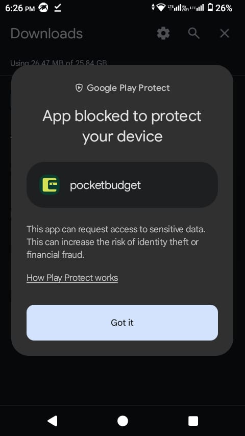
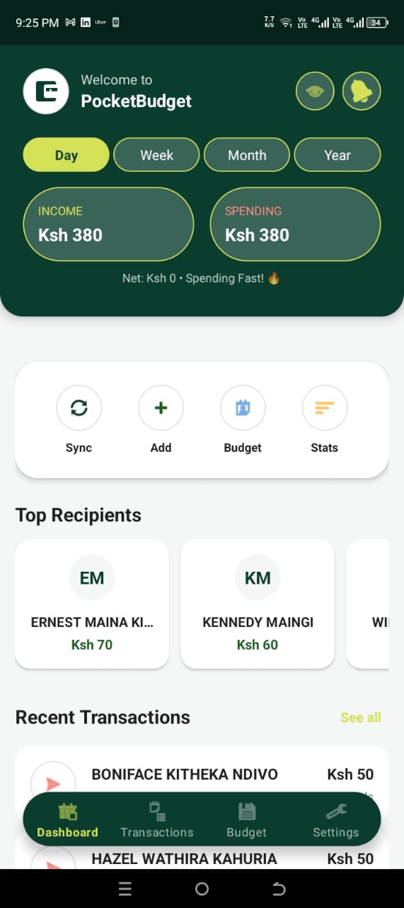
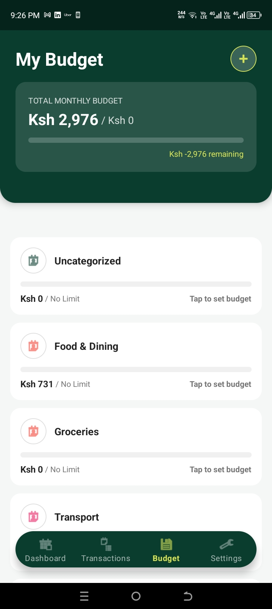
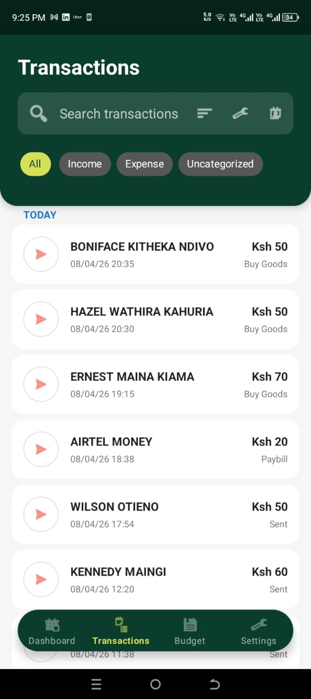
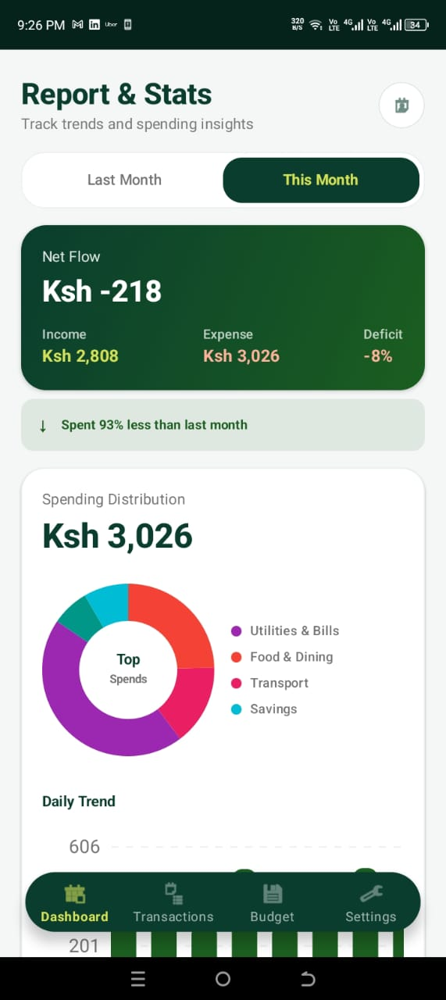
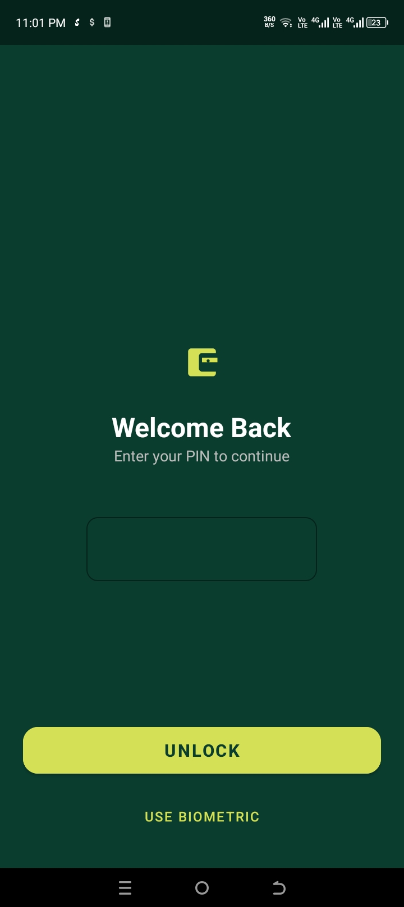
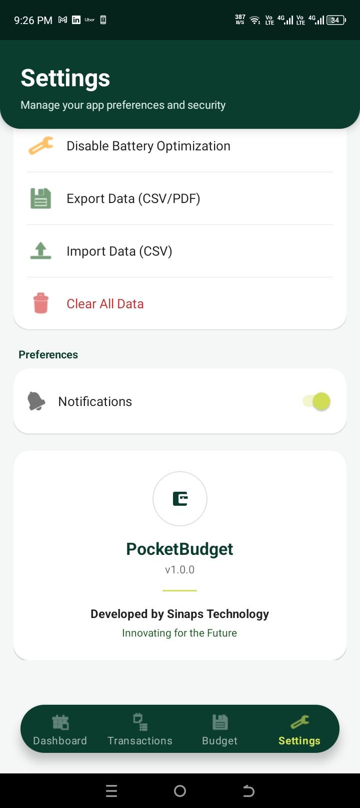

# PocketBudget KE

PocketBudget KE helps you track spending from M-Pesa messages and understand where your money goes.

## Download the App

[](https://github.com/Bouric0076/pocketbudget/releases)

- Testing builds are available from GitHub Releases:
  https://github.com/Bouric0076/pocketbudget/releases

Always download the latest tagged release unless a specific version is shared with you.

**Track Downloads:** Each release displays download counts on the GitHub Releases page. Check back anytime to see how many users have downloaded your app!

## How to Install (Android)

### Installation and verification

**What You'll See:**

When installing an APK outside Google Play, Android may show a security warning. Only install APKs downloaded from the official release page and verify the published SHA-256 checksum.



The warning message reads:
```
🛡️ Google Play Protect

App blocked to protect your device

This app can request access to sensitive data.
This can increase the risk of identity theft or financial fraud.
```

PocketBudget requires SMS access to import M-Pesa transactions, so Android may treat it as sensitive. Review the requested permissions carefully:

- PocketBudget reads M-Pesa SMS messages to automatically categorize your spending
- ✅ The project source is available on GitHub
- ✅ Transaction data is intended to remain on the device
- ✅ SMS access is used for M-Pesa transaction import

### Step-by-Step Installation

1. **Download the APK** from [GitHub Releases](https://github.com/Bouric0076/pocketbudget/releases)
   - Always download the latest tagged release (e.g., `v1.0` or higher)
   - Look for the `.apk` file attached to each release

2. **Open the APK** on your phone
   - Use your file manager or browser downloads folder
   - Tap to open it

3. **Allow Installation from Unknown Sources** (if prompted)
   - Your browser or file manager will ask: "Allow this app to install apps?"
   - This is normal for GitHub downloads (outside Play Store)
   - Tap **"Install"** or **"Allow"**

4. **Google Play Protect Warning Appears** ← This is the expected step
   - Android may show a warning such as "App blocked to protect your device"
   - If Android blocks the APK, cancel the installation and verify the download and checksum.

5. **Open PocketBudget KE**
   - Tap "Open" when installation finishes
   - Or find it in your app drawer

### Installation Troubleshooting

**Still blocked?**

Do not disable Play Protect. Download the APK again from the official release page, verify its SHA-256 checksum, and report the release version and Android device if the problem continues.

## What the App Does
- Reads M-Pesa transaction SMS messages (with your permission).
- Extracts and saves transaction details.
- Organizes spending into categories.
- Shows summaries and trends to help you budget better.

## App Screenshots

### Dashboard & Overview
View your income, spending, and budget status at a glance:

| Dashboard | Budget Management |
|-----------|------------------|
|  |  |

### Transactions & Analytics
Track individual transactions and analyze spending patterns:

| Transactions List | Analytics & Stats |
|------------------|------------------|
|  |  |

### Security & Settings
Secure your app with PIN lock and customize preferences:

| PIN Lock | Settings |
|----------|----------|
|  |  |

## First-Time Setup
1. Open the app.
2. Allow required permissions (SMS and notifications, if requested).
3. Review your dashboard and recent transactions.
4. Add or adjust categories based on your spending style.

## Privacy and Data
- The app is designed to be offline-first.
- Your transaction data is stored locally on your phone.
- You can stop SMS access anytime from Android App Permissions.

## Testing Feedback
This project is currently in a testing phase.

Please share:
- App version used (from the release page)
- Your Android version and phone model
- What you expected vs what happened
- Screenshots or screen recordings (if possible)

## Common Install Issues

- **"App blocked to protect your device" warning:**
  Do not disable Play Protect. Verify that the APK came from the official release page and matches its published checksum.

- **APK does not install after trying twice:**
  - Make sure you downloaded the **complete APK file** (check file size ~30-50 MB)
  - Enable "Installation from Unknown Sources" for your file manager (Settings → Apps → [File Manager] → Permissions)
  - Do not disable Play Protect; download the APK again and verify its checksum

- **App crashes on launch:**
  - Force close and reopen the app
  - Go to Settings → Apps → PocketBudget → Storage → Delete Cache
  - Restart your phone and try again

- **App cannot read transactions:**
  - Go to Settings → Apps → PocketBudget → Permissions
  - Enable both **"SMS"** and **"Notifications"** permissions
  - Tap the "Sync" button in the app dashboard to manually refresh

- **Missing recent M-Pesa messages:**
  - Open the app and tap **"Sync"** (refresh icon on Dashboard)
  - Force-close and reopen the app (clear app cache from Settings if needed)
  - Make sure SMS and notification permissions are enabled
  - If still missing, check that M-Pesa SMS sender is "MPESA" or "M-PESA" in your messages

- **App keeps asking for permissions:**
  - This is normal on first launch. Grant all requested permissions (SMS, Notifications)
  - You can revoke permissions anytime from Settings, but SMS reading won't work without it

## Project Status
PocketBudget KE is under active development and testing. New builds may include changes and fixes based on user feedback.

## For Developers
If you want the build, release, signing, and contributor workflow details, see [TECHNICAL.md](TECHNICAL.md).
